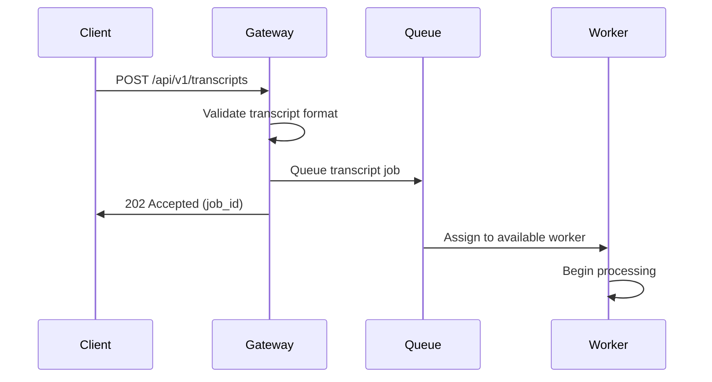

# Complyt AI Transcript Processing Flow Documentation

## Overview

The Complyt AI Transcript Processing Flow leverages the VATGPT platform and OpenAI integration to process natural language transcripts, extract structured data, and trigger webhook notifications. This system combines conversational AI capabilities with the robust webhook infrastructure to provide end-to-end transcript processing.

## Architecture Overview

```
┌─────────────────┐    ┌──────────────────┐    ┌─────────────────┐
│                 │    │                  │    │                 │
│   Transcript    │───▶│   VATGPT         │───▶│   OpenAI        │
│   Input         │    │   Gateway        │    │   Processing    │
│   (Audio/Text)  │    │   (FastAPI)      │    │   (GPT Models)  │
│                 │    │                  │    │                 │
└─────────────────┘    └──────────────────┘    └─────────────────┘
                                │                         │
                                │                         │
                                ▼                         ▼
                       ┌──────────────────┐    ┌─────────────────┐
                       │                  │    │                 │
                       │   RabbitMQ       │    │   Structured    │
                       │   Job Queue      │    │   Data          │
                       │                  │    │   Extraction    │
                       │                  │    │                 │
                       └──────────────────┘    └─────────────────┘
                                │                         │
                                │                         │
                                ▼                         ▼
                       ┌──────────────────┐    ┌─────────────────┐
                       │                  │    │                 │
                       │   Celery         │    │   Entity        │
                       │   Worker         │    │   Creation      │
                       │                  │    │                 │
                       │                  │    │                 │
                       └──────────────────┘    └─────────────────┘
                                │                         │
                                │                         │
                                ▼                         ▼
                       ┌──────────────────┐    ┌─────────────────┐
                       │                  │    │                 │
                       │   Tool           │    │   Webhook       │
                       │   Execution      │    │   Trigger       │
                       │                  │    │                 │
                       │                  │    │                 │
                       └──────────────────┘    └─────────────────┘
```

## Core Components

### 1. VATGPT Platform (V0.6)

The VATGPT platform serves as the AI orchestration layer:

**Key Features:**
- Microservices architecture with FastAPI gateway
- Celery-based asynchronous task processing
- RabbitMQ message queuing
- Tool registry for extensible functionality
- WebSocket support for real-time communication

**Architecture Components:**
```python
# VATGPT Core Services
├── Gateway Service (FastAPI)
├── Worker Service (Celery)
├── Tool Registry (JSON Configs)
├── Communication Layer (WebSocket/HTTP)
└── SDK (Python Client Library)
```

### 2. OpenAI Integration

Based on the QuickBooks implementation pattern, the AI processing uses:

**Configuration:**
```javascript
const DEFAULT_OPENAI_MODEL = "gpt-3.5-turbo-0125";
const OPENAI_TIMEOUT_MS = 8000;
const RATE_LIMIT_DELAY_MS = 150; // ~6.7 RPS to stay under limits
```

**Processing Pattern:**
1. **Input Validation**: Verify transcript format and content
2. **Context Preparation**: Structure prompt with business context
3. **AI Processing**: Send to OpenAI with retry logic
4. **Response Parsing**: Extract structured data from AI response
5. **Validation**: Verify extracted data meets business rules

## Transcript Processing Flow

### Phase 1: Transcript Ingestion



**Transcript Input Format:**
```json
{
  "transcript_id": "550e8400-e29b-41d4-a716-446655440000",
  "client_id": "client-123",
  "source": "audio_recording",
  "content": "Customer called about VAT registration in California...",
  "metadata": {
    "duration": 180,
    "language": "en-US",
    "confidence": 0.95,
    "timestamp": "2024-08-07T10:30:00Z"
  },
  "webhook_config": {
    "host": "client-webhook.example.com",
    "path": "/webhooks/complyt/transcript-processed",
    "secret_key": "webhook-secret-key"
  }
}
```

### Phase 2: AI Processing

```python
# Example AI processing workflow
async def process_transcript(transcript_data):
    """Process transcript using OpenAI and extract structured data."""
    
    # 1. Prepare context and prompt
    prompt = build_vat_compliance_prompt(transcript_data.content)
    
    # 2. Call OpenAI with retry logic
    try:
        response = await openai_client.chat.completions.create(
            model="gpt-3.5-turbo-0125",
            messages=[
                {"role": "system", "content": VAT_SYSTEM_PROMPT},
                {"role": "user", "content": prompt}
            ],
            temperature=0.1,
            timeout=8.0
        )
        
        # 3. Parse structured response
        extracted_data = parse_ai_response(response.choices[0].message.content)
        
        # 4. Validate business rules
        validated_data = validate_vat_data(extracted_data)
        
        return validated_data
        
    except OpenAIError as e:
        # Implement retry logic with exponential backoff
        await asyncio.sleep(0.15)  # Rate limiting
        raise ProcessingError(f"AI processing failed: {e}")
```

### Phase 3: Entity Creation

Based on the AI processing results, create appropriate Complyt entities:

```python
# Example entity creation
async def create_entities_from_transcript(transcript_id, ai_results):
    """Create Complyt entities based on AI extraction results."""
    
    entities_created = []
    
    # Create client tracking entity if new client identified
    if ai_results.get('new_client'):
        client_entity = ClientTracking(
            tenant_id=ai_results['tenant_id'],
            name=ai_results['client_name'],
            nexus=ai_results['nexus_info'],
            webhook_details=ai_results['webhook_config']
        )
        entities_created.append(client_entity)
    
    # Create sales tax tracking if VAT registration needed
    if ai_results.get('vat_registration_required'):
        sales_tax_entity = SalesTaxTracking(
            complyt_id=generate_uuid(),
            tenant_id=ai_results['tenant_id'],
            state=ai_results['state_info'],
            enforces_sales_tax=True,
            approved=False,  # Requires manual approval
            nexus_state_rule=ai_results['nexus_rules']
        )
        entities_created.append(sales_tax_entity)
    
    return entities_created
```

### Phase 4: Webhook Notification

Once entities are created, trigger webhooks using the existing webhook infrastructure:

```python
async def trigger_transcript_webhooks(transcript_id, entities_created, webhook_config):
    """Trigger webhooks for transcript processing completion."""
    
    # Create webhook wrapper for transcript completion
    transcript_webhook = WebhookEntityWrapper(
        id=generate_uuid(),
        timestamp=datetime.now(),
        action=Action.CREATE,
        webhook_class="io.complyt.domain.TranscriptProcessingResult",
        object=TranscriptProcessingResult(
            transcript_id=transcript_id,
            status="COMPLETED",
            entities_created=[entity.complyt_id for entity in entities_created],
            processing_summary=generate_summary(entities_created)
        ),
        host=webhook_config['host'],
        path=webhook_config['path']
    )
    
    # Send to RabbitMQ for webhook processing
    await webhook_queue.publish(transcript_webhook)
    
    # Also trigger individual entity webhooks
    for entity in entities_created:
        entity_webhook = WebhookEntityWrapper(
            id=generate_uuid(),
            timestamp=datetime.now(),
            action=Action.CREATE,
            webhook_class=entity.__class__.__name__,
            object=entity,
            host=webhook_config['host'],
            path=webhook_config['path']
        )
        await webhook_queue.publish(entity_webhook)
```

## Data Structures

### Transcript Processing Result

```json
{
  "transcript_id": "550e8400-e29b-41d4-a716-446655440000",
  "status": "COMPLETED",
  "processing_time_ms": 2500,
  "ai_confidence": 0.92,
  "entities_created": [
    "123e4567-e89b-12d3-a456-426614174000",
    "987fcdeb-51a2-43d1-9f4e-123456789abc"
  ],
  "extracted_data": {
    "client_name": "Acme Corporation",
    "business_type": "E-commerce",
    "states_mentioned": ["CA", "NY", "TX"],
    "vat_registration_needed": true,
    "urgency": "high",
    "follow_up_required": true
  },
  "processing_summary": {
    "entities_created": 2,
    "webhooks_triggered": 3,
    "manual_review_required": true,
    "estimated_completion_date": "2024-08-14T10:30:00Z"
  }
}
```

### AI Prompt Templates

```python
VAT_SYSTEM_PROMPT = """
You are a VAT compliance expert assistant. Analyze the provided transcript and extract structured information about:

1. Client Information:
   - Company name
   - Business type
   - Contact details

2. VAT/Sales Tax Requirements:
   - States/jurisdictions mentioned
   - Registration requirements
   - Nexus establishment
   - Filing frequencies

3. Urgency and Follow-up:
   - Timeline requirements
   - Manual review needed
   - Priority level

Respond in JSON format with high confidence scores for extracted data.
"""

def build_vat_compliance_prompt(transcript_content):
    """Build context-aware prompt for VAT compliance analysis."""
    return f"""
    Analyze this customer service transcript for VAT compliance requirements:
    
    TRANSCRIPT:
    {transcript_content}
    
    Extract and structure the following information:
    1. Client identification and business details
    2. VAT registration requirements by state/jurisdiction
    3. Nexus establishment needs
    4. Timeline and urgency indicators
    5. Required follow-up actions
    
    Provide confidence scores (0-1) for each extracted field.
    """
```

## Error Handling & Recovery

### Processing Failures

```python
class TranscriptProcessingError(Exception):
    """Base exception for transcript processing errors."""
    pass

class AIProcessingError(TranscriptProcessingError):
    """AI service processing failed."""
    pass

class EntityCreationError(TranscriptProcessingError):
    """Entity creation failed."""
    pass

class WebhookDeliveryError(TranscriptProcessingError):
    """Webhook delivery failed."""
    pass

# Error handling workflow
async def handle_processing_error(transcript_id, error, retry_count=0):
    """Handle transcript processing errors with retry logic."""
    
    max_retries = 3
    
    if retry_count < max_retries:
        # Exponential backoff
        delay = 2 ** retry_count
        await asyncio.sleep(delay)
        
        # Retry processing
        return await process_transcript_with_retry(transcript_id, retry_count + 1)
    
    # Max retries exceeded - send failure webhook
    failure_webhook = WebhookEntityWrapper(
        id=generate_uuid(),
        timestamp=datetime.now(),
        action=Action.ERROR,
        webhook_class="io.complyt.domain.TranscriptProcessingResult",
        object=TranscriptProcessingResult(
            transcript_id=transcript_id,
            status="FAILED",
            error_message=str(error),
            retry_count=retry_count
        ),
        host=webhook_config['host'],
        path=webhook_config['path']
    )
    
    await webhook_queue.publish(failure_webhook)
```

### Partial Processing Recovery

```python
async def handle_partial_processing(transcript_id, partial_results):
    """Handle cases where only some entities were created successfully."""
    
    # Send partial success webhook
    partial_webhook = WebhookEntityWrapper(
        id=generate_uuid(),
        timestamp=datetime.now(),
        action=Action.UPDATE,
        webhook_class="io.complyt.domain.TranscriptProcessingResult",
        object=TranscriptProcessingResult(
            transcript_id=transcript_id,
            status="PARTIAL_SUCCESS",
            entities_created=partial_results['successful_entities'],
            failed_entities=partial_results['failed_entities'],
            manual_review_required=True
        ),
        host=webhook_config['host'],
        path=webhook_config['path']
    )
    
    await webhook_queue.publish(partial_webhook)
```

## Configuration

### VATGPT Configuration

```python
# pyproject.toml
[tool.vatgpt]
name = "complyt-transcript-processor"
version = "0.6.0"

[tool.vatgpt.services]
gateway_port = 8000
worker_concurrency = 4
queue_name = "transcript_processing"

[tool.vatgpt.ai]
openai_model = "gpt-3.5-turbo-0125"
timeout_seconds = 8
rate_limit_rps = 6.7
max_retries = 3

[tool.vatgpt.webhooks]
default_timeout = 30
retry_attempts = 5
backoff_multiplier = 2
```

### Environment Variables

```bash
# OpenAI Configuration
OPENAI_API_KEY=sk-...
OPENAI_MODEL=gpt-3.5-turbo-0125
OPENAI_TIMEOUT=8000

# RabbitMQ Configuration
RABBITMQ_URL=amqp://localhost:5672
TRANSCRIPT_QUEUE=transcript_processing
WEBHOOK_QUEUE=webhook_delivery

# Webhook Configuration
WEBHOOK_SECRET_KEY=your-webhook-secret
WEBHOOK_TIMEOUT=30000
WEBHOOK_RETRIES=5

# Redis Configuration (optional)
REDIS_URL=redis://localhost:6379
REDIS_DB=0
```

## Monitoring & Observability

### Key Metrics

1. **Processing Metrics**
   - Transcript processing time (P50, P95, P99)
   - AI API response time
   - Entity creation success rate
   - Webhook delivery success rate

2. **Quality Metrics**
   - AI confidence scores distribution
   - Manual review rate
   - Processing accuracy (when feedback available)
   - Error rate by error type

3. **System Metrics**
   - Queue depth and processing rate
   - Worker utilization
   - Memory and CPU usage
   - API rate limit utilization

### Logging Strategy

```python
import structlog

logger = structlog.get_logger()

# Processing start
logger.info(
    "transcript_processing_started",
    transcript_id=transcript_id,
    client_id=client_id,
    content_length=len(transcript_content)
)

# AI processing
logger.info(
    "ai_processing_completed",
    transcript_id=transcript_id,
    model_used=model_name,
    processing_time_ms=processing_time,
    confidence_score=confidence
)

# Entity creation
logger.info(
    "entities_created",
    transcript_id=transcript_id,
    entity_count=len(entities),
    entity_types=[type(e).__name__ for e in entities]
)

# Webhook delivery
logger.info(
    "webhooks_triggered",
    transcript_id=transcript_id,
    webhook_count=webhook_count,
    delivery_status="queued"
)
```

### Health Checks

```python
async def health_check():
    """Comprehensive health check for transcript processing system."""
    
    health_status = {
        "status": "healthy",
        "checks": {}
    }
    
    # Check OpenAI API connectivity
    try:
        await openai_client.models.list()
        health_status["checks"]["openai"] = "healthy"
    except Exception as e:
        health_status["checks"]["openai"] = f"unhealthy: {e}"
        health_status["status"] = "degraded"
    
    # Check RabbitMQ connectivity
    try:
        await rabbitmq_client.get_queue_info("transcript_processing")
        health_status["checks"]["rabbitmq"] = "healthy"
    except Exception as e:
        health_status["checks"]["rabbitmq"] = f"unhealthy: {e}"
        health_status["status"] = "unhealthy"
    
    # Check webhook queue depth
    queue_depth = await get_queue_depth("webhook_delivery")
    if queue_depth > 1000:
        health_status["checks"]["webhook_queue"] = f"warning: {queue_depth} items"
        health_status["status"] = "degraded"
    else:
        health_status["checks"]["webhook_queue"] = "healthy"
    
    return health_status
```

## Testing Strategy

### Unit Tests

```python
import pytest
from unittest.mock import AsyncMock, patch

@pytest.mark.asyncio
async def test_transcript_processing_success():
    """Test successful transcript processing flow."""
    
    # Mock dependencies
    with patch('openai_client.chat.completions.create') as mock_openai:
        mock_openai.return_value = create_mock_openai_response()
        
        # Test processing
        result = await process_transcript(sample_transcript)
        
        # Assertions
        assert result.status == "COMPLETED"
        assert len(result.entities_created) > 0
        assert result.ai_confidence > 0.8

@pytest.mark.asyncio
async def test_ai_processing_failure_retry():
    """Test AI processing failure and retry logic."""
    
    with patch('openai_client.chat.completions.create') as mock_openai:
        # First call fails, second succeeds
        mock_openai.side_effect = [
            OpenAIError("Rate limit exceeded"),
            create_mock_openai_response()
        ]
        
        result = await process_transcript_with_retry(sample_transcript)
        
        assert result.status == "COMPLETED"
        assert mock_openai.call_count == 2
```

### Integration Tests

```python
@pytest.mark.integration
async def test_end_to_end_transcript_flow():
    """Test complete transcript processing flow."""
    
    # Submit transcript
    response = await client.post("/api/v1/transcripts", json=sample_transcript)
    job_id = response.json()["job_id"]
    
    # Wait for processing
    await wait_for_job_completion(job_id, timeout=30)
    
    # Verify entities created
    entities = await get_entities_by_transcript(sample_transcript["transcript_id"])
    assert len(entities) > 0
    
    # Verify webhooks sent
    webhooks = await get_webhooks_by_transcript(sample_transcript["transcript_id"])
    assert len(webhooks) > 0
    assert all(w.status == "delivered" for w in webhooks)
```

## Best Practices

### For Developers

1. **Prompt Engineering**: Design clear, specific prompts for consistent AI responses
2. **Error Handling**: Implement comprehensive error handling with proper logging
3. **Rate Limiting**: Respect OpenAI API rate limits with proper delays
4. **Validation**: Always validate AI-extracted data before entity creation
5. **Monitoring**: Implement detailed metrics and alerting

### For Operations

1. **Queue Monitoring**: Monitor RabbitMQ queue depths and processing rates
2. **Cost Management**: Track OpenAI API usage and costs
3. **Performance Tuning**: Optimize worker concurrency based on load
4. **Backup Strategy**: Implement transcript backup and replay capabilities
5. **Security**: Secure API keys and webhook secrets properly

### For Clients

1. **Webhook Handling**: Implement proper webhook signature verification
2. **Idempotency**: Handle duplicate webhook deliveries gracefully
3. **Error Recovery**: Implement retry logic for failed webhook processing
4. **Monitoring**: Track transcript processing success rates and timing
5. **Feedback Loop**: Provide feedback on AI accuracy for continuous improvement

## Future Enhancements

### Planned Features

1. **Multi-Language Support**: Extend AI processing to multiple languages
2. **Custom AI Models**: Support for fine-tuned models per client
3. **Real-Time Processing**: WebSocket-based real-time transcript processing
4. **Batch Processing**: Efficient processing of multiple transcripts
5. **Advanced Analytics**: ML-based insights on transcript patterns

### Integration Enhancements

1. **Voice-to-Text Integration**: Direct audio file processing
2. **CRM Integration**: Automatic client record updates
3. **Document Generation**: Auto-generate compliance documents
4. **Workflow Automation**: Trigger complex business workflows
5. **Audit Trail**: Complete processing history and compliance tracking

---

*This documentation is maintained by the Complyt AI Engineering Team. For questions or updates, please contact the AI team or create an issue in the complyt-ai repository.*

